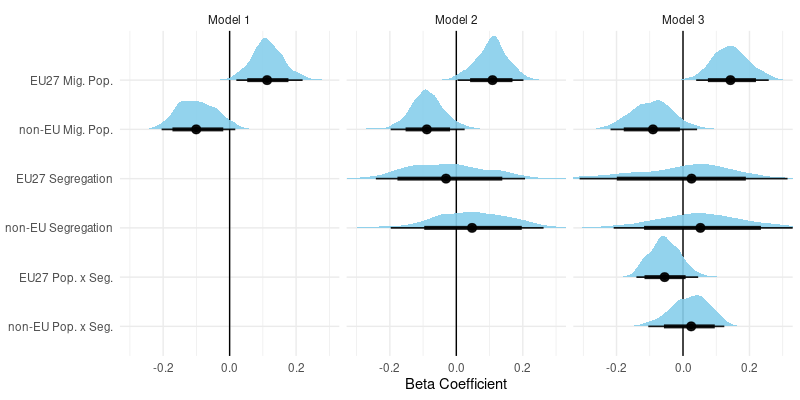
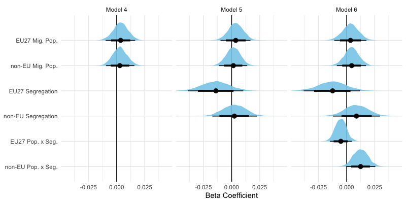
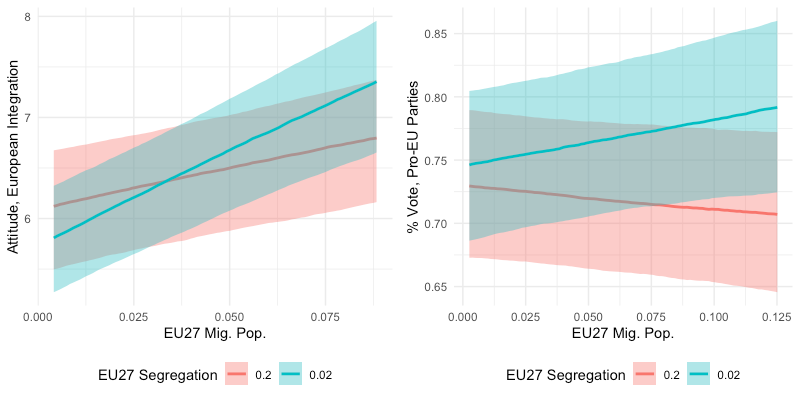

class: full-slide-fig

```{r setup, include = FALSE}
knitr::opts_chunk$set(
  fig.asp = 9/16,
  fig.align = 'center',
  echo = F,
  message = F,
  warning = F,
  out.width = "85%",
  dpi= 300
)
```

```{r xaringan-themer}
library(xaringanthemer)
style_mono_accent(
  base_color = "#353889",
  header_font_google = google_font("Lora"),
  text_font_google   = google_font("Lato", 300),
  text_font_size = "1.4rem",
  title_slide_background_image = "demosocBG.png",
  text_color = "#05050d"
)
```

```{r xaringan-extra}
library(xaringanExtra)
use_logo(
  image_url = "https://upload.wikimedia.org/wikipedia/commons/5/53/Logo_UPF.jpg",
  position = css_position(top = "1em", right = "1em")
)
```

## Introduction

**Migrant Population Dynamics -> Opinions of European Integration**
- Changes in migration patterns are among the most salient effects of European integration on the daily lives of EU citizens.

- Though under-theorized, we expect that the quantity and distribution of migrant populations in your region influences your view of the EU.

- High resolution spatial population data from the Data for Integration (D4I) project allows us to examine this potential relationship from several angles.


---

## Theoretical background

**Group Threat Theory**
- Large or growing out-group populations can lead in-group members to feel threatened and to hold negative attitudes.
- Segregation can harden these attitudes by making differences more salient.

**Contact Theory**
- Contact between in-group and out-group members can reduce prejudicial attitudes, especially in certain conditions. 
- Theory implies that large out-group populations should face less prejudice (due to increased contact with out-groups), though segregation would likely weaken this effect.

**Better understanding of conditions like segregation by help untangle this "paradox"**


---

## How does European integration fit in?

**How well do these theories apply?**
- Group Threat Theory and Contact Theory are mostly applied to attitudes toward out-groups or closely related concepts like voting for the far right.

- Literature has found empirical relationships between segregation and other negative outcomes (crime, trust, etc.).

- Link between European integration and the arrival of EU-born migrants may be more clear that that of non-EU migrants, so theory may better explain the relationship between EU migrant population dynamics and attitudes toward European integration.

---

## Two datasets with a common link

- Both datasets use D4I data (2011) for France, Italy, the Netherlands, Portugal, and Spain at 100x100 meter resolution.
- This data is used to calculate in-group/out-group population proportions and Theil indices of segregation—the key IVs.

**Attitude dataset: NUTS-2/individual levels**
- DV: Attitude toward European integration (0-10) via ESS rounds 6 and 7.
- Individual-level controls and population dynamic variables at the NUTS-2 level.

**Voting behavior dataset: NUTS-3 level**
- DV: % vote for pro-EU parties for European Parliament in 2014 (EU-NED & PopuList).
- Population dynamic variables at the NUTS-3 level.

---

## Modelling strategy

**Bayesian generalized (non-)linear multivariate multilevel models**
- Estimated using brms in R.

- For the attitude dataset, we use cumulative models (ordinal regressions) to account for the distribution of the 0-10 scale dependent variable.

- For the voting behavior dataset, linear models were sufficient. 

---

## Attitudes toward European integration

``` {r}

```
*n: 14,446*
---

## Voting for pro-EU parties 

``` {r}

```
*n: 316*
---

## Conditional Effects: Models 3 & 6

``` {r}

```

---

## Early conclusions

- Link between migrant population dynamics and EU opinions is clearer when considering EU-born migrants

``` {r}
knitr::include_graphics("flow_chart.png")
```

- Contact theory appears to better explain our findings for EU-born migrants

- Segregation is a moderator of the relationship between population size and attitudes

---

## What's next?

**Determine final approach**
- Is the dual-dataset approach useful or is it better to focus on either attitudes or voting behavior?

**Strengthen models**
- Include region-level economic variables, which may be confounding
- Increase *n* of voting behavior dataset by including additional elections
- Attempt to disentangle EU/non-EU vs. cultural similarity question

**Consider heterogeneous effects**
- By education or class on population and/or interaction terms

