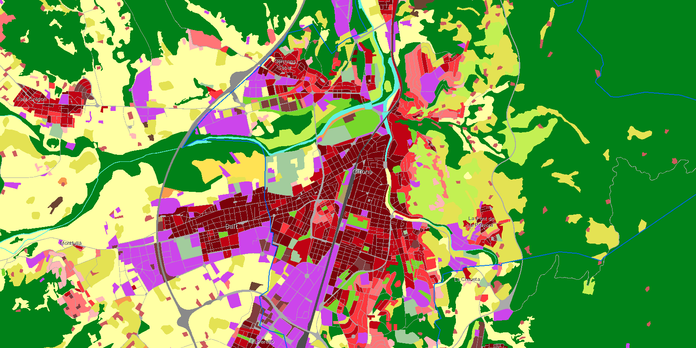
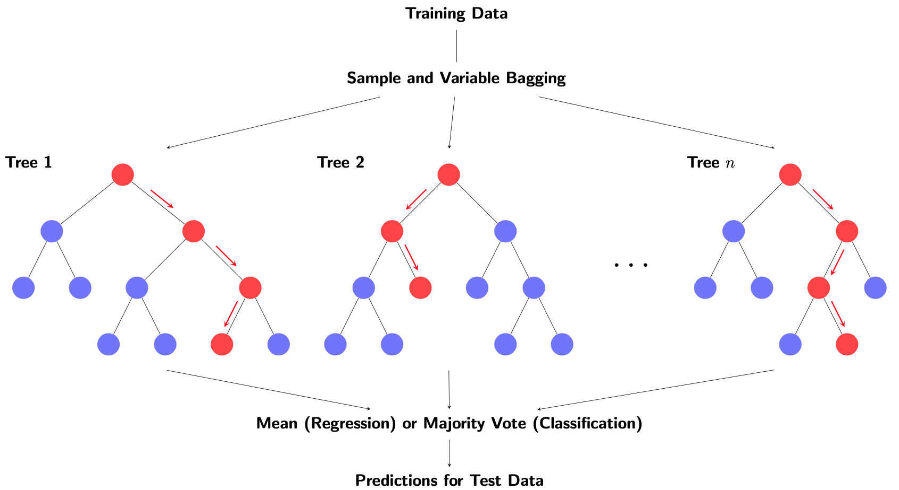
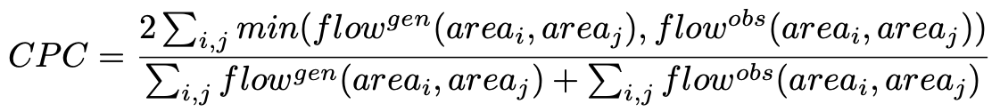
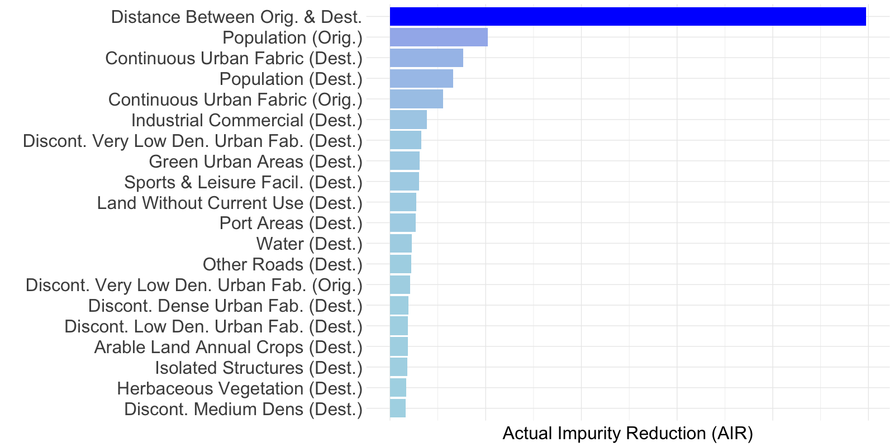
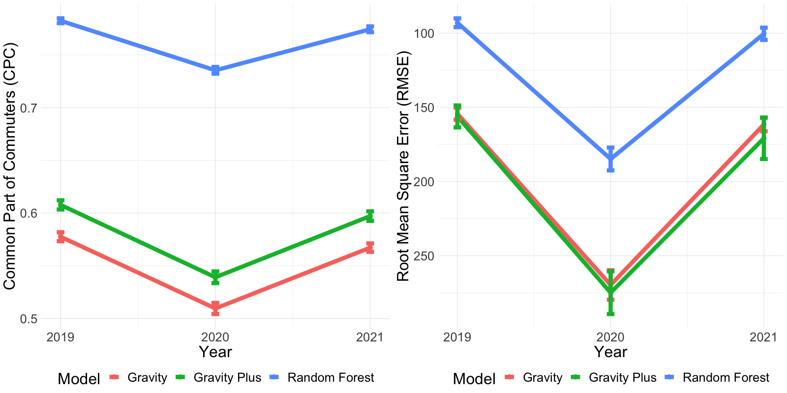
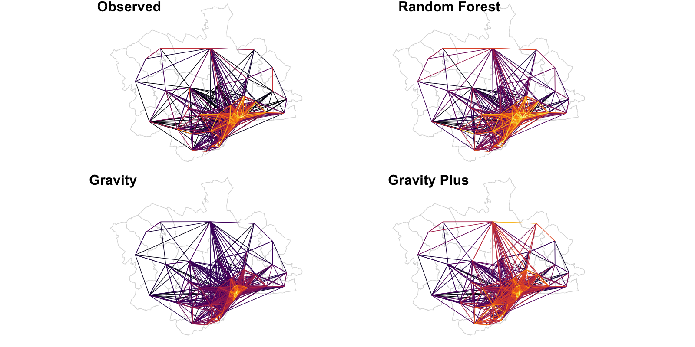
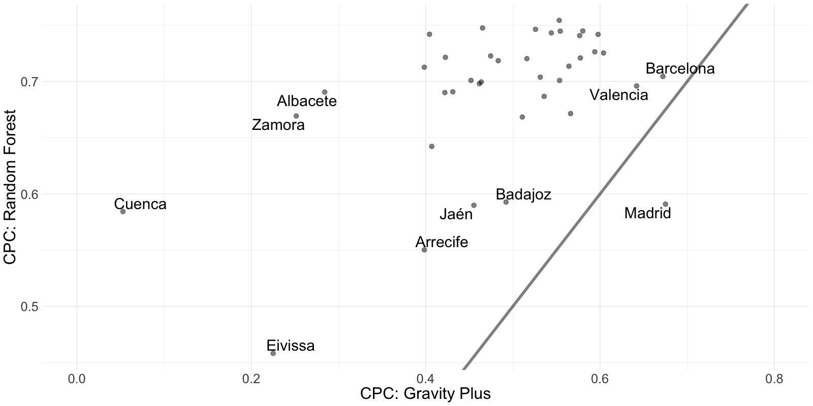
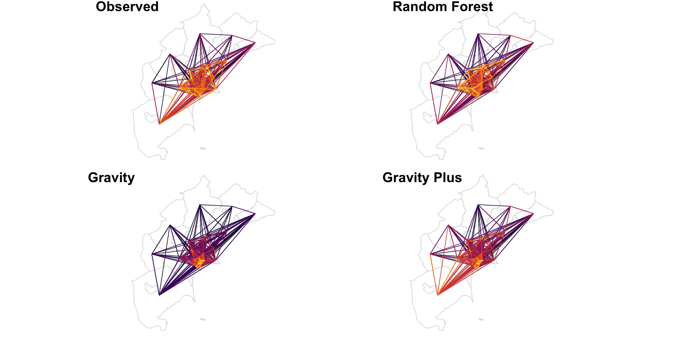
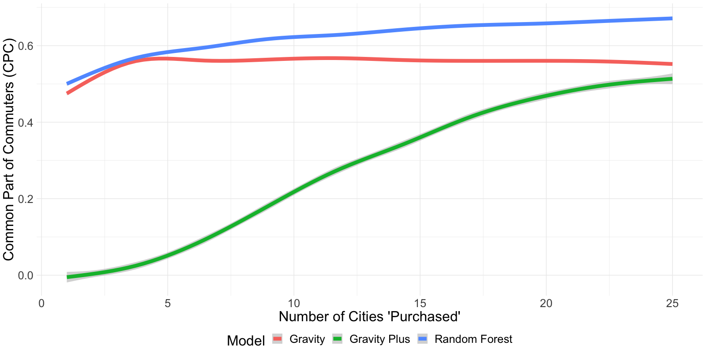

class: full-slide-fig

```{r setup, include = FALSE}
knitr::opts_chunk$set(
  fig.asp = 9/16,
  fig.align = 'center',
  echo = F,
  message = F,
  warning = F,
  out.width = "85%",
  dpi= 300
)
```

```{r xaringan-themer}
library(xaringanthemer)
style_mono_accent(
  base_color = "#353889",
  header_font_google = google_font("Lora"),
  text_font_google   = google_font("Lato", 300),
  text_font_size = "1.4rem",
  title_slide_background_image = "demosocBG.png",
  text_color = "#05050d"
)
```

```{r xaringan-extra}
library(xaringanExtra)
use_logo(
  image_url = "https://waronimmigrants.github.io/images/demosoc_logo.png",
  width = "242px",
  height = "39px",
  position = css_position(top = "1em", right = "1em")
)
```

## Starting Point

**Problem**
- Very popular gravity model of mobility (Zipf, 1946) is elegant and simple but not very accurate.

**Opportunity**
- Abundance of new and underutilized data with machine learning models to take advantage.

**Objective**
- Develop a relatively simple, easy, and fast model that improves on the gravity model.

---

## Approach

**Underutilized predictor data**
- Land cover data from the Copernicus Urban Atlas.

**Fast and easy machine learning**
- Random forests using the `ranger` R package.

**New mobility data for testing**
- INE data from over 40 million mobile phones.

---

## Predictor Data: Copernicus Urban Atlas

``` {r}

```
Land cover types in the Girona FUA. Source: Copernicus Urban Atlas 2018

---

## Maching Learning: Random Forests

``` {r}

```

---

## Outcome Data: Instituto Nacional de Estadística 

``` {r}

```
Average daily mobility flows for Nov. 18-21, 2019. Source: INE Experimental Statistics  

---

## Methods: Models

**Gravity**
- Linear model of flows with distance and population of origin/dest as predictors. 
- All variables are on the log scale.

**Random Forest**
- Includes distance, population, and all land cover variables for origin/dest as predictors.
- 500 trees, 19 variables per tree, 5 observations per terminal node. 

**Gravity Plus**
- Same as gravity model but with all land cover variables as additional predictors.

---

## Methods: Key Tasks in Human Mobility Modelling

**Individual-level path prediction/generation**
- Modelling the trajectories of individuals, outside the scope of this paper.

**Aggregated flow prediction**
- Predicting counts of movement between areas using historic data.

**Aggregated flow generation**
- Generating estimated counts of movement between areas *without* using historic data.

(Luca et al., 2021)

---

## Methods: Model Comparison Metrics

**Root Mean of Squared Errors**
- Popular for comparing predictions generally but not specific to mobility.

**Common Part of Commuters**
- Most popular metric in the literature for this purpose.
- Approximately equal to the percentage of movements accurately predicted.

``` {r}

```

---

## Findings: Variable Importance

``` {r}

```
Variable importance in baseline random forest model with 2019 data.

---

## Findings: Random Flow Generation

``` {r}

```
Tests using data subset by year with random training (80%) and test (20%) sets.

---

## Findings: Real World Flow Prediction

``` {r}

```
Observed and predicted flows for Málaga in 2021 using data from 2019.

---

## Findings: Real World Flow Generation

``` {r}

```
Prediction quality for each city using data from the 38 other cities.

---

## Findings: Real World Flow Generation

``` {r}

```
Observed and generated flows for Alicante using data from the 38 other cities.

---

## Findings: Real World Flow Generation

``` {r}

```
Test of scenario in which researcher can only afford to purchase a subset of the data.

---

## Thank you!

**Data Sources**
- INE Mobility Data: https://ine.es/experimental/movilidad/experimental_em.htm
- Urban Atlas Data: https://land.copernicus.eu/local/urban-atlas/

**R Packages**
- `ranger`: https://cran.r-project.org/web/packages/ranger/ranger.pdf
- `sf`: https://r-spatial.github.io/sf/
