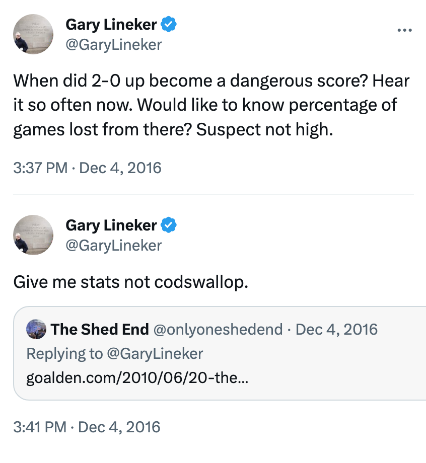
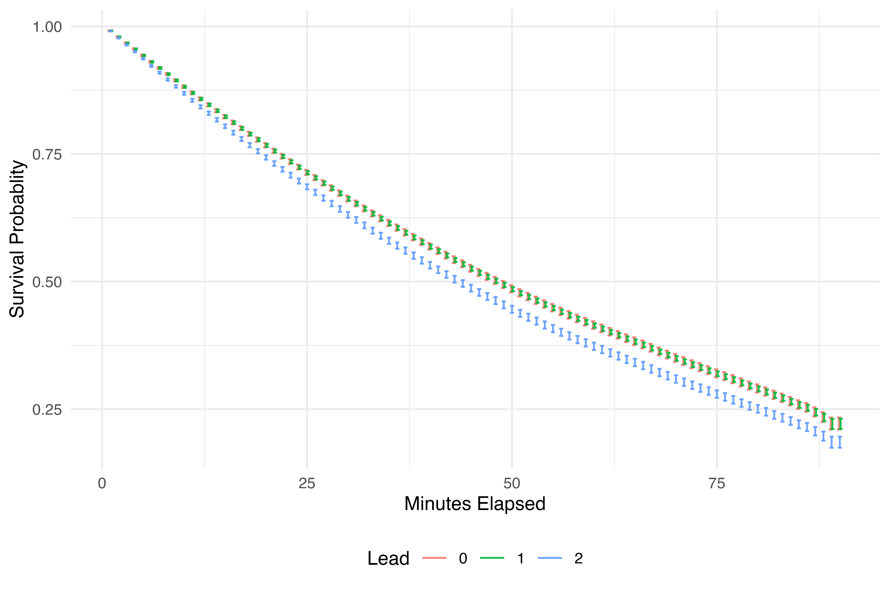
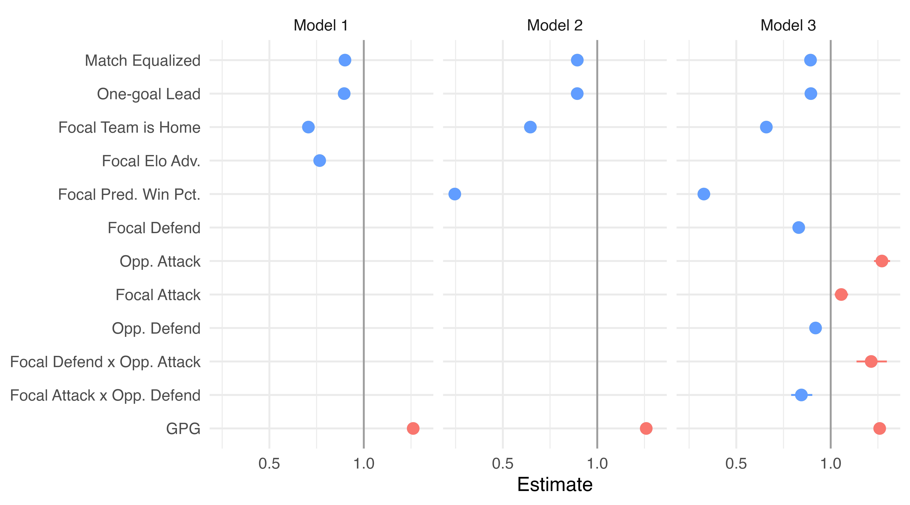
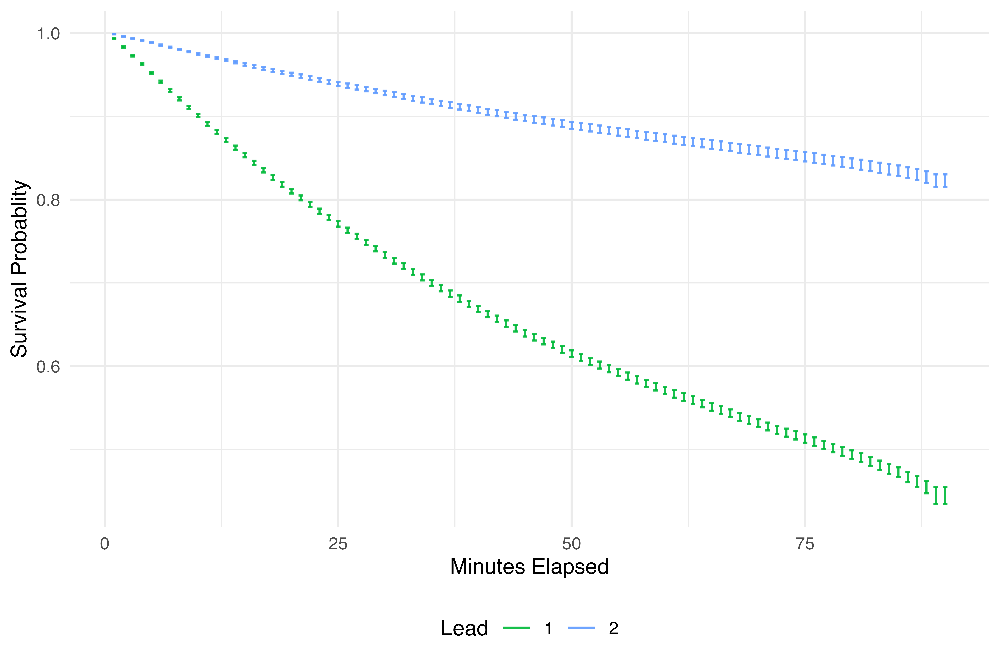

```{r setup, include=FALSE}
knitr::opts_chunk$set(echo = FALSE)
```

## The Most Dangerous Lead in Soccer
<div class="columns-2">
  - Legend is well known in soccer and ice hockey communities
  - Data journalists and academics tend to dismiss it
  - Brimberg & Hurley (2012) say the "availability heuristic" is to blame
  - But is there any truth to the legend that teams are especially vulnerable when up by two?

  {width=80%}
  </div>

## First Steps

Data from David Schoch including nearly 100,000 matches from 10 European men's first divisions

Two-goal leads hold up about 93 percent of the time (much more often than one-goal leads)

But:

- Feeling of danger may arise even when teams ultimately win
- Teams with two-goal leads are probably stronger, on average, than those with one-goal leads
- Two-goal leads necessarily occur after one-goal leads, so there is less time to overturn them

##

{width=100%}

## Survival analysis

- Origin in medical research but used to investigate analogous problems in other fields
- Interested in how long it takes for an event (death, goal conceded) to occur
- Data is right censored: either the event occurs or the observation period ends
- Cox Proportional-Hazards Models function like other multivariate regressions:

<center>*H*(*t*) = *H*~0~(*t*) x exp(*b*~1~*x*~1~ + *b*~2~*x*~2~ + ... + *b*~*k*~*x*~*k*~)</center>

## Survival analysis: Two-goal leads

**Start of observation**: minute focal team scores to take a one- or two-goal lead or level the match

**Time**: match minutes elapsed

**Hazard status**: goal conceded or match ends (censored)

**Predictor variables**:

- Score differential
- Team strength measures: Élő and Rue-Salvesen models
- Focal team is home or away
- League-season scoring environment

## 

{width=100%}
<font size="3">Survival curves for model with Rue-Salvesen team strength measures</font>

## 

{width=100%}
<font size="3">Estimated beta coefficients of predictor variables for all models</font>

## 

{width=100%}
<font size="3">Survival curves for maintaining lead instead of conceding goal</font>

## So, are two-goal leads the most dangerous in soccer?

- After 20 minutes, teams are about 3 percent more likely to have conceded if they have a two-goal lead
- For professional athletes, a 3 percent disadvantage is enormous!
- Even the most statistically-illiterate proponents of the legend don't think two-goal leads are *worse* than one-goal leads, just that they are deceptively perlious

## Next steps

Do teams panic if they concede after going up by two?

Postdoc Proposal: **Comeback Dynamics**

- Complete research on the baseline conditions under which comebacks are most likely
- How do substitutions contribute to the probability of a comeback?
- Do players change their shot-taking decisions based on the score and does this influence comebacks?
- Begin to formulate a theory of comebacks: model how physical, psychological, and tactical factors interact and generate testable hypotheses
